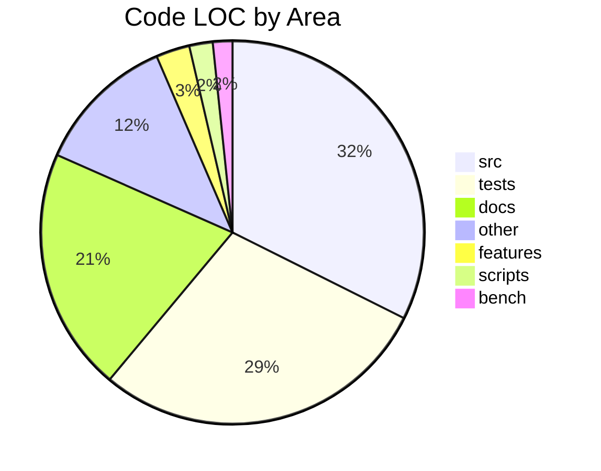
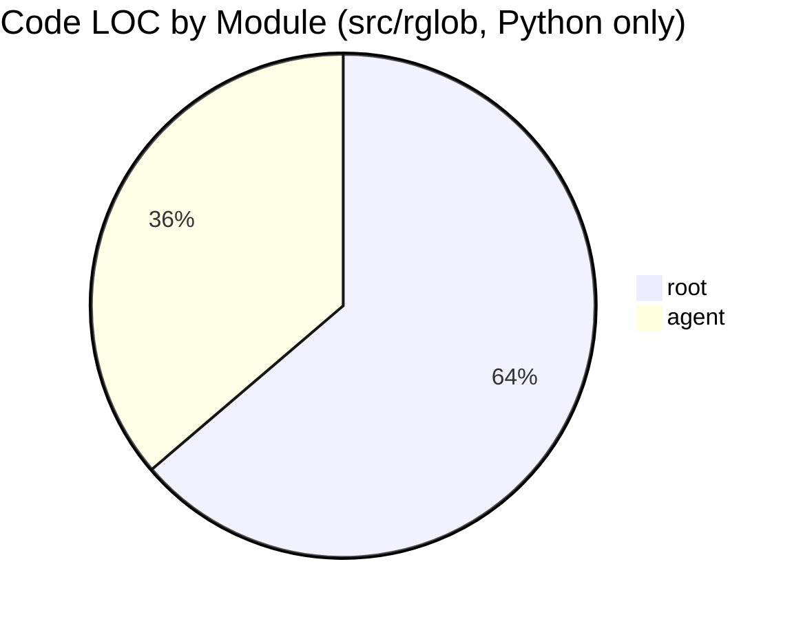

# rglob — Repository Overview

Auto-generated repository stats live below; everything outside
the `REPO-STATS` markers is hand-written.

<!-- BEGIN: REPO-STATS -->

## Repository Stats

- Code LOC (approx): 9,919
- Total lines (tracked files): 12,482

### LOC by Area
| Area | Code LOC | Total Lines |
|------|----------|-------------|
| src | 3,212 | 3,864 |
| tests | 2,846 | 3,815 |
| docs | 2,038 | 2,526 |
| other | 1,181 | 1,410 |
| features | 282 | 368 |
| scripts | 196 | 249 |
| bench | 164 | 250 |

### Code LOC by Module (Python only)

### Top Python Modules (src/rglob)
| Module (src/rglob, .py only) | Code LOC | Total Lines |
|------------------------------|----------|-------------|
| root | 2,047 | 2,506 |
| agent | 1,165 | 1,358 |

_Note: LOC approximates non-blank, non-comment lines. Module breakdown counts only Python files._

<!-- END: REPO-STATS -->

