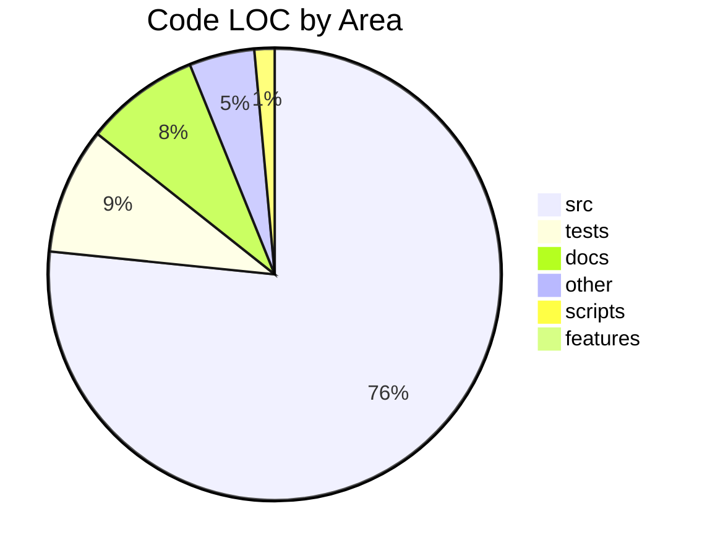
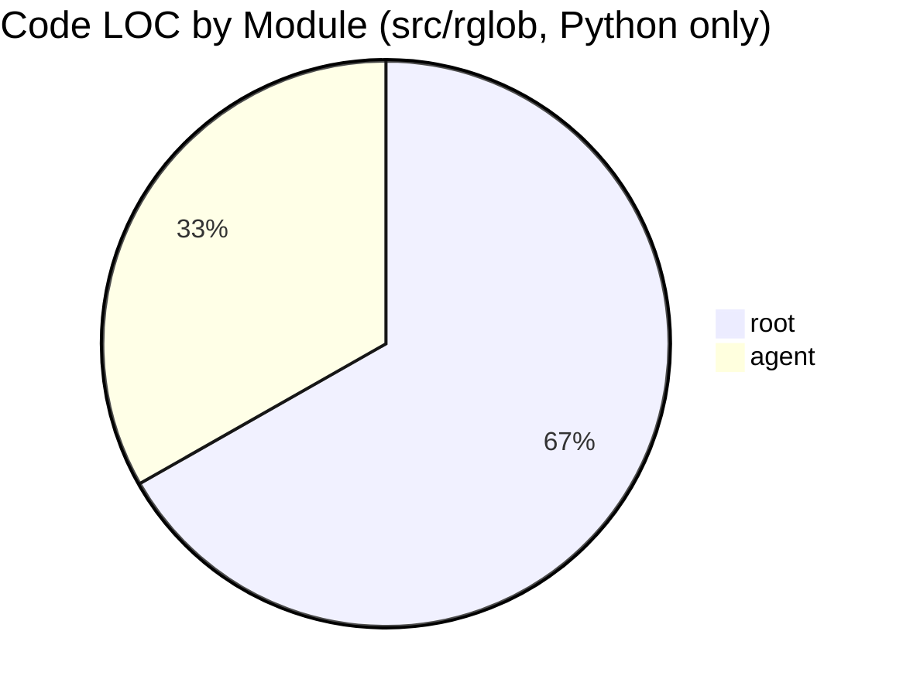

# rglob — Repository Overview

Auto-generated repository stats live below; everything outside
the `REPO-STATS` markers is hand-written.

<!-- BEGIN: REPO-STATS -->

## Repository Stats

- Code LOC (approx): 24,288
- Total lines (tracked files): 26,370

### LOC by Area
| Area | Code LOC | Total Lines |
|------|----------|-------------|
| src | 18,485 | 18,986 |
| tests | 2,185 | 2,927 |
| docs | 1,982 | 2,463 |
| other | 1,126 | 1,346 |
| scripts | 348 | 436 |
| features | 162 | 212 |

### Code LOC by Module (Python only)

### Top Python Modules (src/rglob)
| Module (src/rglob, .py only) | Code LOC | Total Lines |
|------------------------------|----------|-------------|
| root | 1,736 | 2,081 |
| agent | 864 | 1,020 |

_Note: LOC approximates non-blank, non-comment lines. Module breakdown counts only Python files._

<!-- END: REPO-STATS -->

