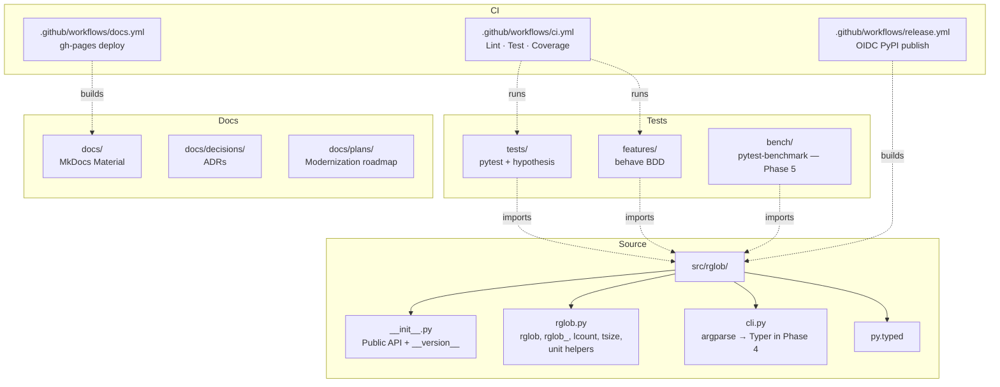
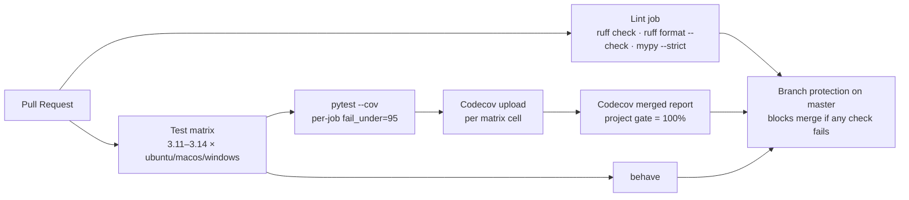
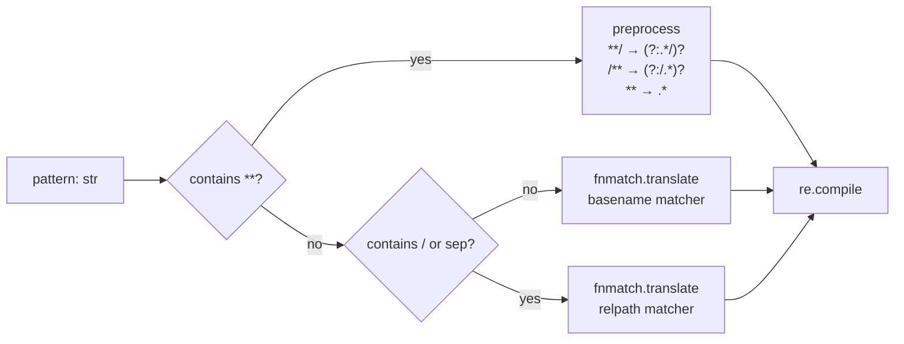
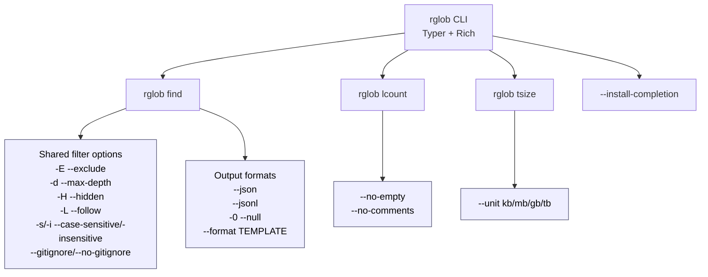
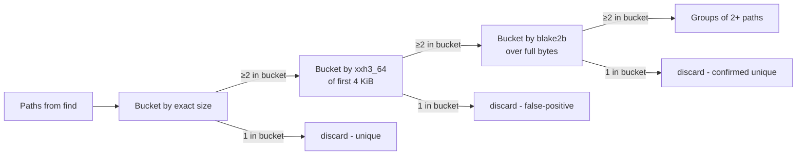
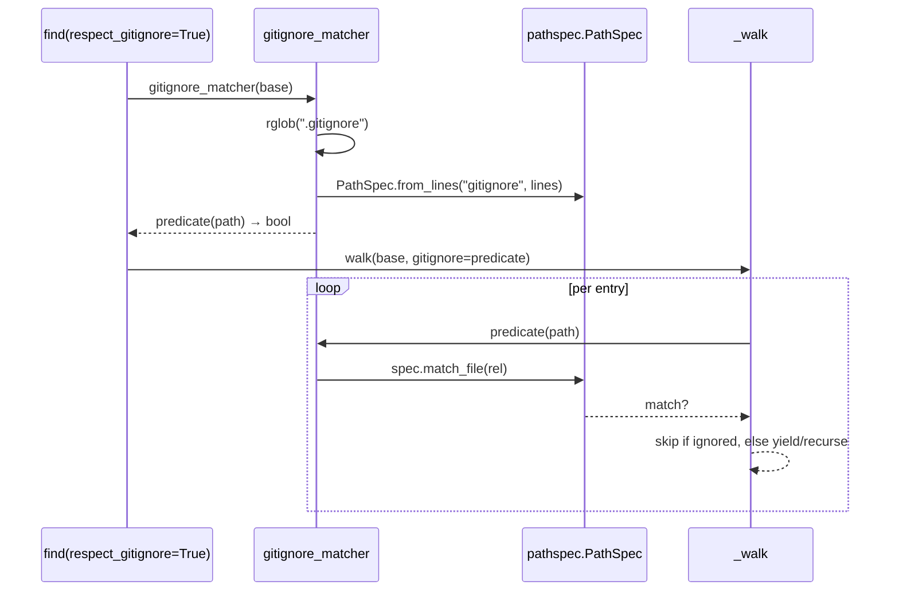
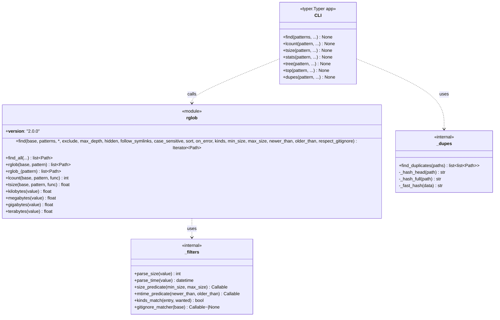

# Architecture

This page describes the package shape and how the pieces fit together. It
accretes per phase — each later phase adds its own diagrams (CLI hierarchy,
walker call-graph, `dupes` pipeline, final public-API class diagram).

## Phase 2 — Package layout



## Phase 2 — CI flow



## Walker call-graph — Phase 3

```mermaid
flowchart TD
    USER[find(base, patterns, ...)]
    COMPILE[_compile_patterns<br/>fnmatch + ** translation]
    HANDLER[_make_error_handler<br/>ignore | warn | raise]
    WALK[_walk<br/>recursive descent]
    SCAN[os.scandir<br/>cached DirEntry.d_type]
    SORT{sort?}
    MATCH[_matches_any<br/>basename or rel-path]
    EXCLUDE[exclude matchers]
    DEPTH{max_depth?}
    HIDDEN{hidden=False<br/>and name.startswith('.')?}
    REAL[os.path.realpath<br/>cycle memo]
    YIELD[yield Path]

    USER --> COMPILE --> WALK
    USER --> HANDLER --> WALK
    WALK --> SCAN
    SCAN --> SORT
    SORT --> MATCH
    MATCH --> EXCLUDE
    EXCLUDE -- excluded --> WALK
    EXCLUDE -- kept --> HIDDEN
    HIDDEN -- skip --> WALK
    HIDDEN -- keep --> YIELD
    YIELD --> DEPTH
    DEPTH -- under limit --> REAL
    REAL -- new --> WALK
    REAL -- already visited --> WALK
```

## Symlink-loop detection

```mermaid
sequenceDiagram
    participant F as find(...)
    participant W as _walk
    participant FS as os.scandir
    participant R as os.path.realpath
    participant V as visited: set[str]

    F->>V: add realpath(base)
    F->>W: walk(base, depth=0)
    W->>FS: scandir(base)
    FS-->>W: [a/, sym->base]
    W->>R: realpath(base/a/)
    R-->>W: /base/a (new)
    W->>V: add /base/a
    W->>W: recurse(base/a, depth=1)

    W->>R: realpath(base/sym)
    R-->>W: /base (already in V)
    W-->>F: skip; do not recurse
```

## Pattern translation (the `**` story)



## CLI command hierarchy — Phase 4



Each subcommand calls into `rglob.rglob.find()` (or the legacy `rglob` /
`lcount` / `tsize` wrappers); the CLI is a thin Typer layer over the
library API.

## `dupes` pipeline — Phase 5



Large unique files only ever read their first 4 KiB; the full hash only
runs on confirmed candidates.

## `.gitignore` pruning sequence — Phase 5



## Public API surface — 2.0



The user-facing surface is intentionally small: one module-level `find()`
generator plus six legacy compatibility helpers, all importable directly
from `rglob`. Internal modules (`_filters`, `_dupes`) are prefixed with
`_` and not re-exported.
